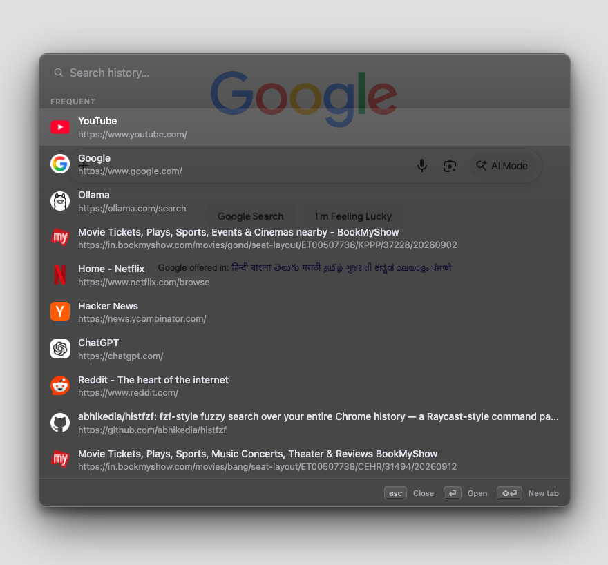
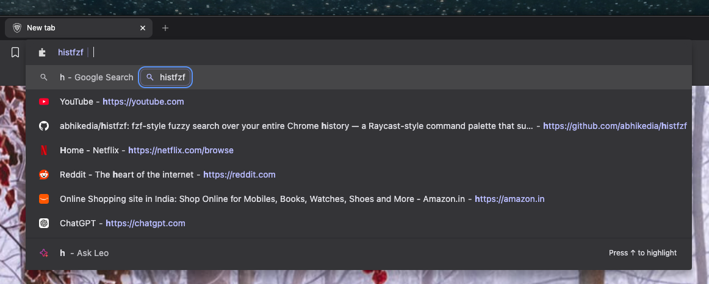
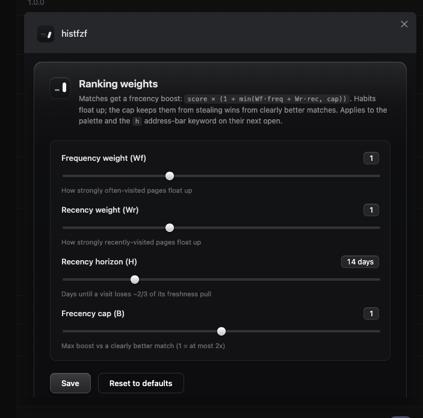

# HistFzf

**fzf for your Chrome history — a keyboard-first command palette that keeps your history forever.**

Hit one shortcut, type a loose fragment of a page title or URL (`ghpr` lands on `github.com/…/pull-requests`), see ranked results with matched characters highlighted, press Enter to jump.

<p align="center">
  
</p>

---

## Why

Chrome's address-bar history search is weak: prefix-biased matching, opaque ranking, and Chrome only retains **~90 days** of history. HistFzf is for people who live on the keyboard and love the `fzf` finder: an independent, permanent copy of your history that you can fuzzy-match against with the *real* fzf algorithm — ranked the way launchers like Raycast and Arc rank.

## Features

| | |
|---|---|
| **One shortcut, one palette** | `Ctrl+R` (Mac: physical `Control+R`) opens a centered fuzzy palette over the current tab. Works on tabs that were already open before install. |
| **Authentic fzf matching** | The genuine fzf subsequence algorithm (via [`fzf-for-js`](https://github.com/ajitid/fzf-for-js)) over `title + URL`, with matched characters bolded at their exact positions. |
| **Bounded frecency ranking** | `score × (1 + min(Wf·freq + Wr·rec, 1))` — like Raycast/Arc: frequency (log-compressed so megasites can't dominate) and recency (14-day exponential decay) reorder comparable matches, but a habit can never steal the win from a clearly better match. Both weights are tunable in the options page. |
| **Your history, kept forever** | On install the extension seeds its own IndexedDB copy from your existing Chrome history (backward-walking weekly windows, resumable), then captures every new visit live. Pages Chrome evicted years ago still surface. |
| **URL canonicalization** | `github.com/pulls`, `github.com/pulls/` and `…?utm_source=rss` are one record with one visit count; the original URL is kept for navigation. |
| **Full keyboard model** | ↓/↑ or `Ctrl-N`/`Ctrl-P` (stops at the ends, never wraps), `Enter` opens in the current tab, `Shift`/`Cmd/Ctrl+Enter` opens a new tab, `Esc`/click-outside closes. Hovering is the same mechanism as the keyboard. |
| **Frecency landing list** | Open the palette, don't type — see your top habits immediately (UC4). |
| **Empty-title fallback** | First-visit pages are never blank rows: the URL becomes the primary line. |
| **Favicons with a fallback** | Chrome's favicon service, with a globe for sites Chrome doesn't know. |
| **Omnibox entry point** | `h` + Space in the address bar — works on *any* tab, including `chrome://` pages the palette can't inject into. Same ranking engine, 6 rows. |

<p align="center">
  
</p>

### Install (from source)

```bash
git clone <this repo> && cd histfzf
npm install
npm run build
```

Load it: `chrome://extensions` → enable **Developer mode** → **Load unpacked** → select `dist/`.

On install HistFzf asks for a minimal permission set — no *“read and change all your data on all websites”* prompt, no background hoarding (details below).

### The shortcut

Default: `Ctrl+Shift+Space` on Windows/Linux, physical `Control+R` (`MacCtrl+R`) on Mac — deliberately chosen so browser-level `Ctrl/R`+`Cmd`+`R` are untouched. Rebind it at `chrome://extensions/shortcuts`.

### Palette keys

| Key | Action |
|---|---|
| `↓` / `Ctrl+N` | Next result |
| `↑` / `Ctrl+P` | Previous result |
| `Enter` | Open in the **current** tab |
| `Shift+Enter` / `Cmd+Enter` / `Ctrl+Enter` | Open in a new tab |
| `Esc` / click outside | Close (reopening is instant — the palette never unmounts) |
| type | Live fuzzy search, matched characters highlighted |

Selection stops at the ends — it never wraps (fzf behavior).

### Omnibox keyword (`h` + Space)

Type `h`, Space, then a fuzzy fragment — suggestions live right inside the address bar, on **any** tab, including Chrome's privileged pages (`chrome://…`) where the palette is barred by the browser itself. Enter opens in the current tab, the Alt/Cmd-style dispositions open a tab. Up to 6 rows, identical ranking engine.

<p align="center">
  
</p>

Known Chrome limitation: the keyword dropdown's row icons are renderer-controlled (Chrome may not show them once you type) — the palette is the icon-rich surface.

### Restricted pages (`chrome://`, new tab, Web Store)

Injection is impossible on privileged pages (a Chrome rule), so pressing the shortcut there opens the palette as its **own activated tab** — same UI, same engine, and dismissing it returns you to where you were.

### Tune the ranking (options page)

`chrome://extensions` → HistFzf → **Extension options** → four sliders backed by `chrome.storage`:

<p align="center">
  
</p>

| Knob | Meaning |
|---|---|
| **Wf** | How strongly often-visited pages float up |
| **Wr** | How strongly recently-visited pages float up |
| **H** (days) | Recency horizon — the exponential decay of a visit's pull |
| **B** (frecency cap) | Boost ceiling vs clearly better matches (`1` → at most 2×) |

Changes apply to the palette's next open / the omnibox's next session. *Feeling underwhelmed after tuning? Check the cap — at the default cap, habits contribute at most 2× no matter the weights.*

## How it works

```
┌─ Service worker ───────────────────────────────┐
│ seeds chrome.history on install (resumable),   │
│ captures every visit + title live, and owns    │
│ every write to IndexedDB                       │
└──────────────┬─────────────────────────────────┘
               │ shortcut press (wakes the SW at any time)
               ▼
┌─ Page tab ─────────────────────────────────────┐
│ content script injects an extension-origin     │
│ iframe — CSS/CSP-isolated from every site      │
│   └─ React palette:                            │
│      loads the whole index ONCE per open,      │
│      then searches purely in RAM —             │
│        fzf pass → frecency blend → top-50 cut  │
└────────────────────────────────────────────────┘
```

Design decisions worth reading:

- **Own index, not Chrome's** — an independent record per canonical URL (`{url, title, visitCount, typedCount, …}`) that survives Chrome's 90-day eviction. By *design*, deleting Chrome's history does not delete ours.
- **One GET per open, RAM after** — the hot path never touches storage: precomputed haystacks, an Fzf built once per open, and incremental query-order narrowing (growing a query re-scans ≤500 rows, not 20k+).
- **Fake it correctly at 16px** — icons render from SDF-built RGBA masters (`tools/render-icon.py`), so what you see in the toolbar is what's in the vectors, not a white-boxed thumbnail.
- **No remote code** — MV3 requires it and users deserve it: zero CDN requests, zero eval.

## Privacy & permissions

HistFzf is a **local, single-user tool**. Nothing leaves your machine — no accounts, no analytics, no network calls, no remote code.

| Permission | Reason |
|---|---|
| `history` | Seed the index from existing history; capture new visits |
| `tabs` | Capture page titles (they arrive separately from visits) · open new tabs |
| `storage` | Seed watermark + your ranking settings |
| `activeTab` + `scripting` | Inject the palette into the *current* tab on shortcut press — the install prompt never asks for "read and change all data on all websites" |
| `favicon` | The `_favicon/` endpoint for row icons |

No host permissions, no `unlimitedStorage`.

**Data semantics:** clearing Chrome's browsing history does *not* clear HistFzf's copy — that's the point of owning the index (use the toolbar to remove the extension to delete everything). A future `onVisitRemoved` opt-in is on the roadmap but off by default on purpose.

## Development

```bash
npm install
npm run dev        # dev build with HMR → dist/ (run + Load unpacked dist/)
npm run build      # typecheck + production build (+ release zip)
npm run test       # vitest — every runtime module has a suite
npm run typecheck  # tsc only
```

- Tests: **126 unit tests** across 12 files — the storage layer runs against `fake-indexeddb`; separator-level "chrome" behavior is covered through a mock harness; the fuzzy-matching/ordering guarantees are pinned by ordering-flip proofs.
- Icon pipeline: edit `icons/icon.svg` (or any of the SVG masters), then `python3 tools/render-icon.py` regenerates all four PNG sizes with true-alpha edges.
- Production zip: `release/crx-histfzf-<version>.zip` is packed by every build.

## Known limitations

- **Restricted pages** — the palette opens as its own tab (the platform-safe workaround) and the omnibox covers the rest of the Chrome UI.
- **Omnibox dropdown icons** — Chrome's renderer decides per state; keyword-scoped extension suggestions often lose their row icons once you type. The palette is the icon-rich surface.
- **Seeded history favicons** — Chrome's icon database fills as you *browse*; far-future seeded records fall back to the globe until you visit the sites again.
- **Dark palette over light tabs** — the palette is intentionally a dark surface; light mode is on the roadmap.

## Roadmap

- [ ] Index pruning cap (oldest / lowest-frecency, ~100k cap)
- Options page: tracking-URL list editor
- `history.onVisitRemoved` opt-in (delete-alongside Chrome, off by default)
- Light mode
- "2d ago" accessory hints on rows · selection-wrap toggle

## Tech

TypeScript · React 19 · Vite + CRXJS · [`fzf-for-js`](https://github.com/ajitid/fzf-for-js) (BSD-3) · [`idb`](https://github.com/jakearchibald/idb) · vitest + fake-indexeddb + jsdom · a pure-stdlib Python rasterizer for the icon pipeline.

## License

[MIT](./LICENSE) © 2026 Abhishek Kedia — free to use, modify, and ship; attribution valued beyond the notice.
